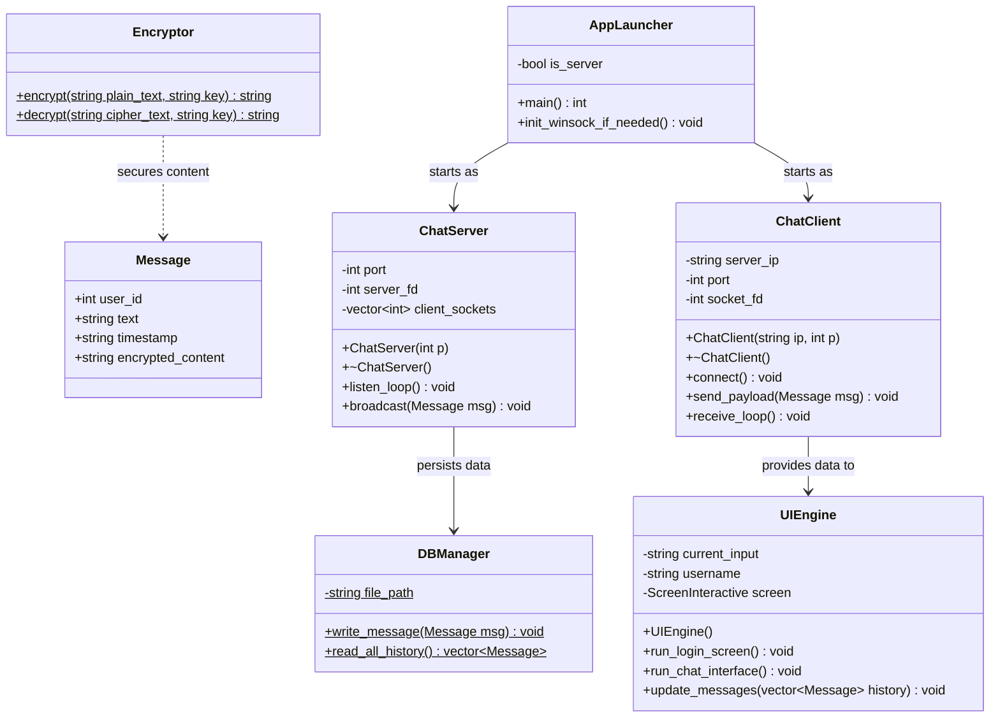

# Broadcast

## About
Broadcast is a global terminal-based chat system without private rooms—just one continuous stream where everyone communicates together. It brings back the raw, geeky 2000s vibe, reminiscent of the era that laid the foundation for classic internet forums.

## Core Idea
The project relies on a custom TCP socket server written in pure C++ with custom encryption. Upon launch, you enter a startup menu where you can host a server or connect to an existing broadcast session via IP and Port. 
The main workflow: clone the project, build the app, host the server, and share your IP/Port with friends to chat globally.

## Tech Stack
* **C++17**
* **FTXUI** (Functional Terminal Extension UI)
* **CMake**

## Prerequisites
To build the project from source, ensure you have the following installed on your system:
* CMake (>= 3.10)
* A C++17 compatible compiler (GCC or Clang)
* Make

## Build Instructions
Clone the repository and build the project using standard CMake commands:

```bash
git clone https://github.com/lomon23/broadcast.git
cd broadcast
mkdir build && cd build
cmake ..
make
```
Run the executable:

```bash
./broadcast
```
Package Installation (Fedora / RHEL)

If you have the pre-built .rpm package (broadcast-lomon), you can install it directly via dnf without building from source:

```bash 
sudo dnf install ./broadcast-lomon-1.0-1.fcXX.x86_64.rpm
```
Once installed, simply run broadcast-lomon from any terminal.
Architecture & Lifecycle

Thread A (Main/UI): FTXUI renders the chat interface and waits for the user to press Enter. Once triggered, it encrypts the message and executes a send() to the server.

Thread B (Receiver): An infinite loop running while(true) { recv(...) }. As soon as a broadcast packet arrives from the server, this thread updates the message vector in memory, and FTXUI automatically triggers a screen redraw.

Data Flow:
Client (Object) ➔ JSON string ➔ TCP Socket ➔ Server (JSON string) ➔ File (JSON DB) ➔ Server ➔ TCP Socket ➔ All Clients (JSON string) ➔ Decrypt ➔ Client (Object) ➔ UI Update


# Class diagram:

# Squinse diagram

```mermaid
sequenceDiagram
    participant C as Client (User)
    participant UI as UIEngine (FTXUI)
    participant E as Encryptor
    participant S as Server (Your Arch)
    participant DB as DBManager (JSON)

    C->>UI: Вводить текст + Enter
    UI->>E: encrypt("Привіт")
    E-->>UI: "x8jK9..." (encrypted)
    UI->>C: send_payload(Message)
    Note over C,S: Передача через TCP Socket
    C->>S: Encrypted Packet
    S->>DB: write_message(Encrypted)
    DB-->>S: OK (Saved to JSON)
    S->>S: Цикл по всім client_sockets
    S->>C: broadcast(Encrypted Packet)
    Note over S,C: Повернення до всіх клієнтів
    C->>E: decrypt("x8jK9...")
    E-->>C: "Привіт"
    C->>UI: update_chat_area()
    UI-->>C: Відображення на екрані
```
