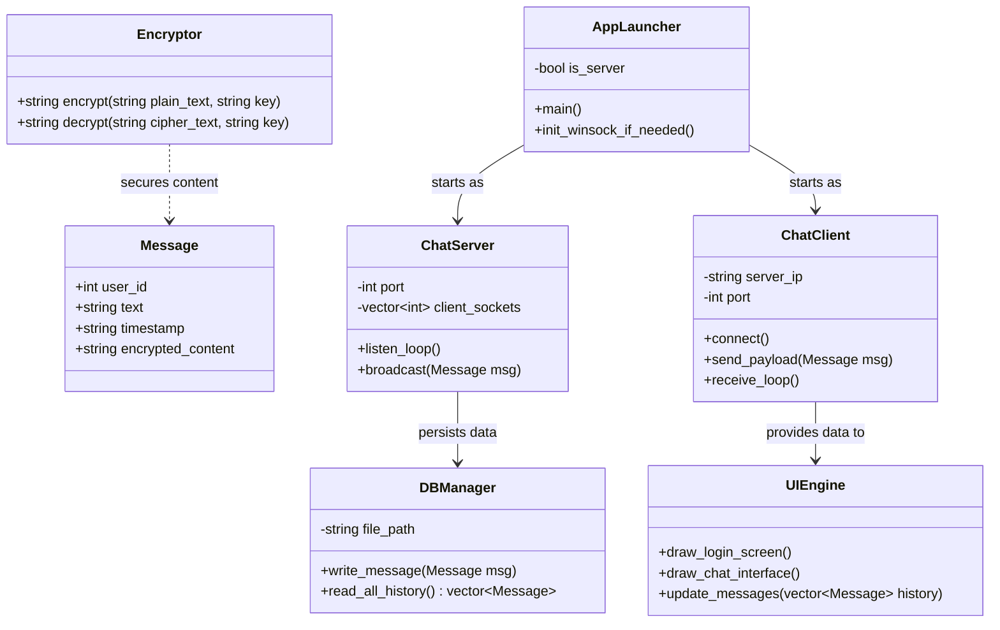
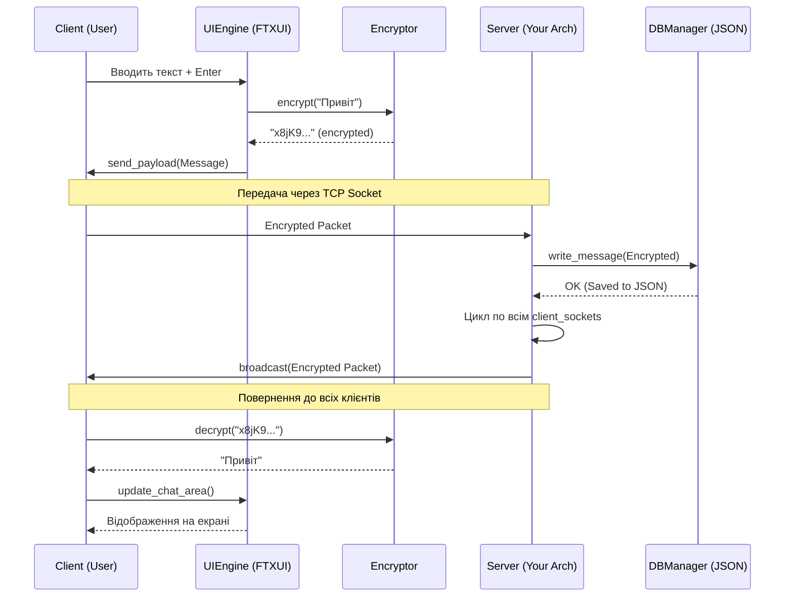

# broadcast

# Про що? 
брод каст, це значення чату в якому немає поділу на приватні чати, це один суцільний чат, в якому всі можуть переписуватись, це нас вертає в гіковські часи 2000х, де цбула база для форумів

# Основна ідея:
створити свій socket сервер на чистому с++ з своїм шифруванням
зробити початкове меню, де ти повинен підключитись по посиланню до цього бродкасту і в ньому вже можна переписуватись, і добавити інструкцію накшталт, склонуйте проект, скачайте таку апку, захосьте, і давайте це посилання своїм друзям/всім

# Stack:
* c++ 17
* FTXUIW
* CMake

# live cycle
Потік А (Main/UI): FTXUI малює чат і чекає, поки ти натиснеш Enter. Коли натиснув — робить send() на сервер.

Потік Б (Receiver): Нескінченний цикл while(true) { recv(...) }. Як тільки від сервера прилетів бродкаст, цей потік оновлює вектор повідомлень у пам'яті, і FTXUI автоматично перемальовує екран.

Клієнт (об'єкт) -> JSON string -> Сокет -> Сервер (JSON string) -> Файл -> Сервер (JSON string) -> Сокет -> Усі клієнти (JSON string) -> Клієнт (об'єкт) -> UI
# Class diagram:

# Squinse diagram
